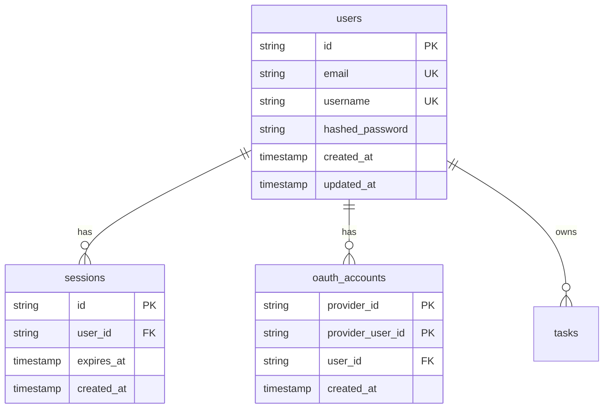
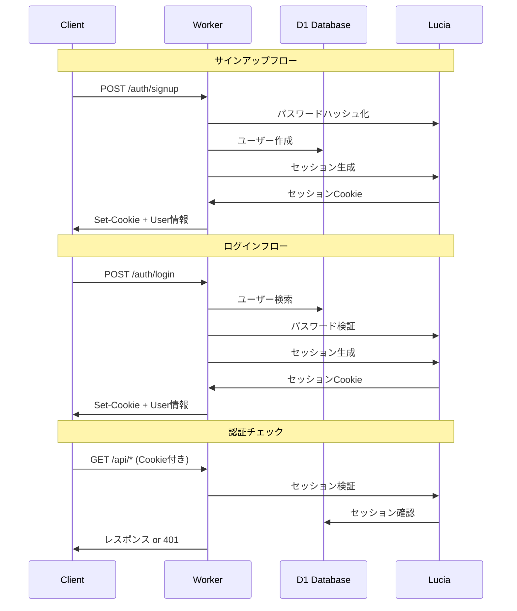

# ミルタス - 認証システム実装ガイド

## 📋 目次
1. [概要](#概要)
2. [技術選定](#技術選定)
3. [アーキテクチャ設計](#アーキテクチャ設計)
4. [実装フロー](#実装フロー)
5. [セキュリティ考慮事項](#セキュリティ考慮事項)
6. [テスト戦略](#テスト戦略)

---

## 📝 概要

### 認証システムの要件
- **ユーザー登録・ログイン機能**
- **セッション管理**
- **セキュアなパスワード保存**
- **Remember Me機能**
- **将来的なOAuth対応**（Google、Discord等）

### 制約事項
- Cloudflare Workers環境での動作
- ステートレスな実行環境
- D1（SQLite）データベース使用
- エッジ環境でのパフォーマンス最適化

---

## 🔧 技術選定

### 推奨：Lucia Auth v3

#### 選定理由
1. **軽量性** - Workers環境に最適なサイズ
2. **柔軟性** - カスタマイズが容易
3. **型安全** - TypeScript完全対応
4. **D1対応** - SQLiteアダプター提供
5. **モダン** - 最新のセキュリティプラクティス

#### 代替案比較

| ライブラリ | メリット | デメリット | 推奨度 |
|-----------|---------|-----------|--------|
| Lucia Auth | 軽量、D1対応、型安全 | 比較的新しい | ★★★★★ |
| Auth.js | 多機能、プロバイダー豊富 | Workers対応が実験的 | ★★★☆☆ |
| 自前実装 | 完全カスタマイズ可能 | 実装コスト高、セキュリティリスク | ★★☆☆☆ |
| Cloudflare Zero Trust | ネイティブ統合 | 有料、カスタマイズ制限 | ★★★☆☆ |

---

## 🏗️ アーキテクチャ設計

### データベース設計



### 認証フロー



### セッション管理戦略

#### Cookie設定
- **httpOnly**: true（XSS対策）
- **secure**: true（HTTPS必須）
- **sameSite**: lax（CSRF対策）
- **有効期限**: 30日（調整可能）

#### セッション更新
- アクティブユーザーのセッション自動延長
- 非アクティブセッションの自動削除
- デバイス別セッション管理（将来実装）

---

## 📋 実装フロー

### Phase 1: 基本認証（1週間）

1. **データベース準備**
   - D1データベース作成
   - 認証テーブルのマイグレーション
   - インデックス設定

2. **バックエンド実装**
   - Lucia Auth初期設定
   - 認証エンドポイント作成
   - 認証ミドルウェア実装
   - エラーハンドリング

3. **フロントエンド実装**
   - ログイン/サインアップフォーム
   - 認証状態管理（Zustand）
   - プロテクトルート実装
   - エラー表示

### Phase 2: セキュリティ強化（3日）

1. **レート制限**
   - ログイン試行回数制限
   - IPベースの制限
   - アカウントロック機能

2. **追加セキュリティ**
   - CSRF対策
   - セッションフィンガープリント
   - 異常検知（異なる地域からのアクセス）

### Phase 3: UX改善（3日）

1. **利便性機能**
   - Remember Me
   - パスワードリセット
   - メールアドレス確認

2. **UI/UX改善**
   - ローディング状態
   - エラーメッセージの最適化
   - リダイレクト処理

### Phase 4: OAuth統合（将来）

1. **プロバイダー追加**
   - Google認証
   - Discord認証
   - GitHub認証

2. **アカウント連携**
   - 複数認証方法の紐付け
   - プライマリ認証方法の設定

---

## 🔒 セキュリティ考慮事項

### パスワード保護
- **Scrypt**アルゴリズム使用（Argon2代替）
- 適切なコストパラメータ設定
- ソルト自動生成

### セッションセキュリティ
- セッションID：暗号学的に安全な乱数
- セッションローテーション
- 同時セッション数制限

### 一般的な脆弱性対策

| 脆弱性 | 対策 |
|--------|------|
| SQLインジェクション | プリペアドステートメント使用 |
| XSS | httpOnly Cookie、入力検証 |
| CSRF | SameSite Cookie、CSRFトークン |
| ブルートフォース | レート制限、アカウントロック |
| セッション固定化 | ログイン時の再生成 |

### Cloudflare特有の考慮事項
- **グローバル分散**：セッション整合性
- **エッジ実行**：レイテンシ考慮
- **リクエスト制限**：効率的なDB使用

---

## 🧪 テスト戦略

### ユニットテスト
- パスワードハッシュ化
- セッション生成・検証
- 入力バリデーション

### 統合テスト
- 認証フロー全体
- ミドルウェア動作
- エラーケース

### E2Eテスト
- ユーザー登録〜ログイン
- セッション維持
- ログアウト処理

### セキュリティテスト
- ペネトレーションテスト
- 脆弱性スキャン
- レート制限動作確認

### パフォーマンステスト
- 認証処理時間
- 同時接続数
- グローバルレイテンシ

---

## 📊 モニタリング・運用

### 監視項目
- ログイン成功/失敗率
- セッション作成数
- 異常なアクセスパターン
- レスポンスタイム

### ログ設計
- 認証イベント記録
- エラーログ
- セキュリティイベント
- パフォーマンスメトリクス

### アラート設定
- 大量のログイン失敗
- 異常なトラフィック
- システムエラー率上昇

---

## 🚀 ベストプラクティス

### DO ✅
- セッションの定期的なローテーション
- 詳細なエラーログ（内部用）
- ユーザーフレンドリーなエラーメッセージ
- 定期的なセキュリティ監査

### DON'T ❌
- パスワードの平文保存
- 詳細なエラー情報の露出
- 無制限のログイン試行
- セッション情報のローカルストレージ保存

---

## 📅 実装スケジュール

| フェーズ | 期間 | 成果物 |
|---------|------|--------|
| Phase 1 | 1週間 | 基本的な認証機能 |
| Phase 2 | 3日 | セキュリティ強化 |
| Phase 3 | 3日 | UX改善 |
| Phase 4 | 2週間 | OAuth統合（将来） |

---

## 🎨 UI/UX設計

### デザイン原則

1. **シンプルさ優先**
   - 必要最小限の入力項目
   - 明確なアクション
   - 直感的なフロー

2. **エラー処理**
   - リアルタイムバリデーション
   - 分かりやすいエラーメッセージ
   - 復旧方法の提示

3. **アクセシビリティ**
   - キーボード操作対応
   - スクリーンリーダー対応
   - 十分なコントラスト比

### 画面設計

#### 1. ログイン画面

```
┌─────────────────────────────────────┐
│          ミルタス                  │
│                                     │
│  ┌─────────────────────────────┐   │
│  │ メールアドレス               │   │
│  │ [user@example.com        ]  │   │
│  └─────────────────────────────┘   │
│                                     │
│  ┌─────────────────────────────┐   │
│  │ パスワード                   │   │
│  │ [••••••••••            👁]  │   │
│  └─────────────────────────────┘   │
│                                     │
│  □ ログイン状態を保持する           │
│                                     │
│  ┌─────────────────────────────┐   │
│  │        ログイン             │   │
│  └─────────────────────────────┘   │
│                                     │
│  パスワードを忘れた方               │
│  ─────────────────────────────      │
│  アカウントをお持ちでない方         │
│  新規登録はこちら                   │
│                                     │
└─────────────────────────────────────┘
```

**UI要素仕様**
- **入力フィールド**: フォーカス時に青いボーダー
- **パスワード表示切替**: アイコンクリックで表示/非表示
- **ログインボタン**: プライマリカラー、ホバーエフェクト
- **リンク**: 下線なし、ホバー時に下線表示

#### 2. サインアップ画面

```
┌─────────────────────────────────────┐
│        アカウント作成                │
│                                     │
│  ┌─────────────────────────────┐   │
│  │ ユーザー名                   │   │
│  │ [otaku_taro           ]     │   │
│  │ 3-20文字の英数字と_が使用可  │   │
│  └─────────────────────────────┘   │
│                                     │
│  ┌─────────────────────────────┐   │
│  │ メールアドレス               │   │
│  │ [user@example.com      ]     │   │
│  └─────────────────────────────┘   │
│                                     │
│  ┌─────────────────────────────┐   │
│  │ パスワード                   │   │
│  │ [••••••••              ]     │   │
│  │ ━━━━━━━━━━━━ 強度: 中        │   │
│  │ ✓ 8文字以上                  │   │
│  │ ✓ 大文字を含む               │   │
│  │ ✗ 数字を含む                 │   │
│  │ ✗ 記号を含む                 │   │
│  └─────────────────────────────┘   │
│                                     │
│  ┌─────────────────────────────┐   │
│  │ パスワード（確認）           │   │
│  │ [••••••••              ]     │   │
│  └─────────────────────────────┘   │
│                                     │
│  □ 利用規約に同意する               │
│                                     │
│  ┌─────────────────────────────┐   │
│  │      アカウント作成         │   │
│  └─────────────────────────────┘   │
│                                     │
│  既にアカウントをお持ちの方         │
│  ログインはこちら                   │
│                                     │
└─────────────────────────────────────┘
```

**UI要素仕様**
- **パスワード強度インジケーター**: リアルタイム更新
- **バリデーション表示**: チェックマーク/エラーアイコン
- **利用規約**: リンククリックでモーダル表示

#### 3. パスワードリセット画面

```
┌─────────────────────────────────────┐
│      パスワードをリセット            │
│                                     │
│  登録メールアドレスにリセット用の    │
│  リンクを送信します。               │
│                                     │
│  ┌─────────────────────────────┐   │
│  │ メールアドレス               │   │
│  │ [user@example.com      ]     │   │
│  └─────────────────────────────┘   │
│                                     │
│  ┌─────────────────────────────┐   │
│  │    リセットリンクを送信     │   │
│  └─────────────────────────────┘   │
│                                     │
│  ログイン画面に戻る                 │
│                                     │
└─────────────────────────────────────┘
```

### コンポーネント設計

#### 入力フィールドコンポーネント

| プロパティ | 型 | 説明 |
|-----------|---|------|
| label | string | フィールドラベル |
| type | string | input type属性 |
| error | string? | エラーメッセージ |
| hint | string? | ヒントテキスト |
| icon | ReactNode? | アイコン |

#### 状態管理

```
AuthFormState {
  mode: 'login' | 'signup' | 'reset'
  isLoading: boolean
  errors: {
    field: string
    message: string
  }[]
  values: {
    email: string
    password: string
    username?: string
    confirmPassword?: string
  }
}
```

### インタラクション設計

#### フォームバリデーション

1. **リアルタイムバリデーション**
   - フィールドのフォーカスアウト時
   - 入力中の即時フィードバック（パスワード強度）

2. **エラー表示タイミング**
   - 初回：フィールドのblur時
   - 2回目以降：入力中にリアルタイム

3. **バリデーションルール**

| フィールド | ルール |
|-----------|--------|
| メールアドレス | RFC5322準拠、最大100文字 |
| パスワード | 8-100文字、複雑性チェック |
| ユーザー名 | 3-20文字、英数字と_のみ |

#### ローディング状態

```
┌─────────────────────────────┐
│  ◯ ◯ ◯  ログイン中...      │ <- ボタンがローディング表示
└─────────────────────────────┘
```

- フォーム全体を無効化
- ボタンにスピナー表示
- 「処理中...」のテキスト表示

#### エラー処理UI

```
┌─────────────────────────────────────┐
│  ⚠️ ログインに失敗しました           │
│  メールアドレスまたはパスワードが    │
│  正しくありません。                  │
└─────────────────────────────────────┘
```

**エラー種別と表示**

| エラー種別 | 表示メッセージ | アクション |
|-----------|--------------|-----------|
| 認証失敗 | ログイン情報が正しくありません | 再入力促す |
| ネットワーク | 接続エラーが発生しました | リトライボタン |
| サーバーエラー | 一時的な問題が発生しています | しばらく待つよう案内 |
| レート制限 | 試行回数が上限に達しました | 時間を置くよう案内 |

### レスポンシブデザイン

#### ブレークポイント
- **モバイル**: < 640px
- **タブレット**: 640px - 1024px  
- **デスクトップ**: > 1024px

#### モバイル最適化
- タッチターゲット: 最小44x44px
- フォントサイズ: 最小16px（ズーム防止）
- 縦向き・横向き対応

### アニメーション・トランジション

1. **フォームトランジション**
   - ログイン↔サインアップ: スライドアニメーション
   - 所要時間: 300ms
   - イージング: ease-in-out

2. **マイクロインタラクション**
   - ボタンホバー: スケール1.02
   - フォーカス: ボーダー色変化
   - エラー: シェイクアニメーション

3. **成功時のフィードバック**
   - チェックマークアニメーション
   - 自動リダイレクト（2秒後）

### ダークモード対応

| 要素 | ライトモード | ダークモード |
|------|------------|-------------|
| 背景 | #FFFFFF | #1A1A1A |
| テキスト | #000000 | #FFFFFF |
| 入力フィールド | #F5F5F5 | #2D2D2D |
| ボーダー | #E0E0E0 | #404040 |
| エラー | #EF4444 | #F87171 |
| 成功 | #10B981 | #34D399 |

### アクセシビリティ考慮

1. **ARIA属性**
   - aria-label: 全ての入力フィールド
   - aria-invalid: エラー状態
   - aria-describedby: エラーメッセージ

2. **キーボード操作**
   - Tab順序の適切な設定
   - Enterキーでのフォーム送信
   - Escapeキーでのモーダル閉じる

3. **スクリーンリーダー対応**
   - エラーメッセージの即座の読み上げ
   - 成功メッセージの通知
   - フォーム状態の明確な伝達

### パフォーマンス最適化

1. **コード分割**
   - 認証コンポーネントの遅延読み込み
   - 未使用時のバンドルサイズ削減

2. **フォーム最適化**
   - デバウンスによるバリデーション制御
   - メモ化による再レンダリング防止

3. **画像・アセット**
   - SVGアイコンの使用
   - Webフォントの最適化

---

## 📚 参考資料

### 公式ドキュメント
- [Lucia Auth Documentation](https://lucia-auth.com/)
- [Cloudflare D1 Documentation](https://developers.cloudflare.com/d1/)
- [OWASP Authentication Cheat Sheet](https://cheatsheetseries.owasp.org/cheatsheets/Authentication_Cheat_Sheet.html)

### セキュリティガイドライン
- NIST SP 800-63B（デジタル認証ガイドライン）
- OWASP Top 10
- Cloudflare Security Best Practices