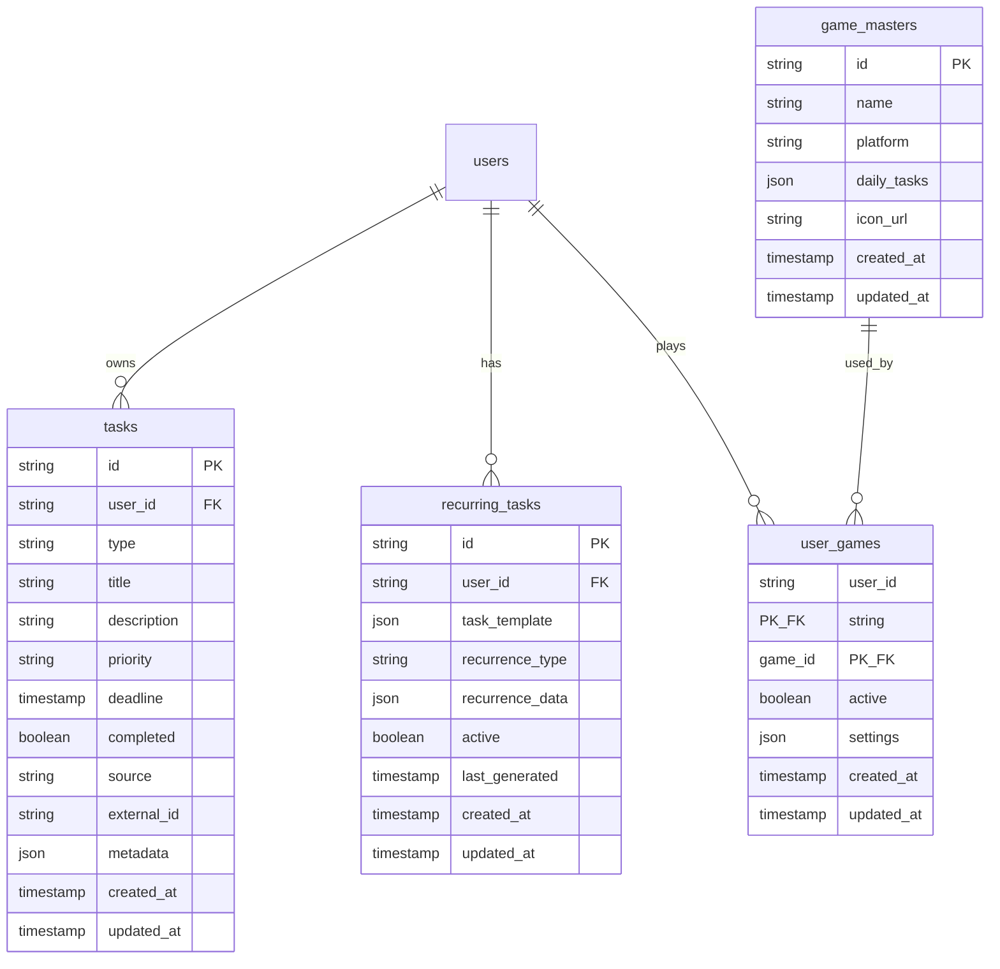
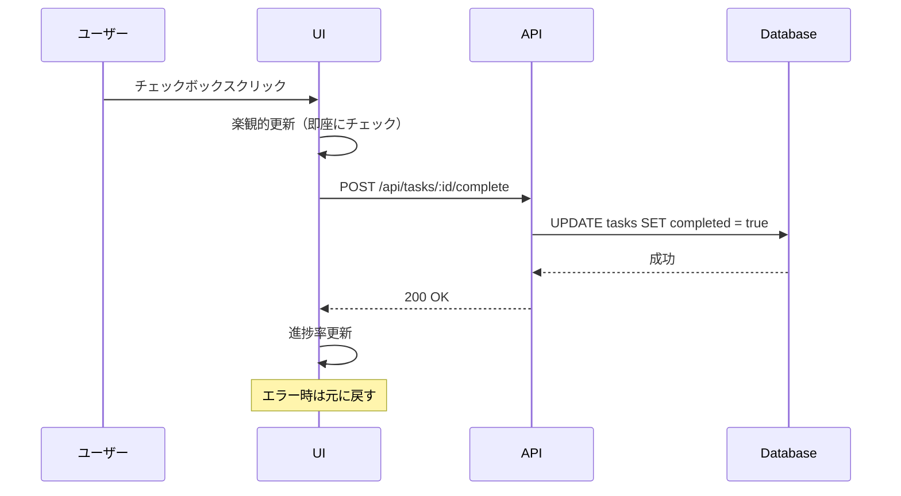
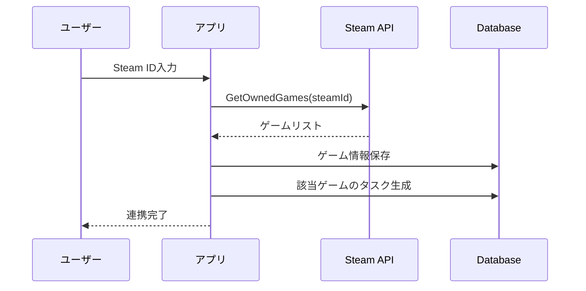

# ミルタス - デイリータスク機能実装ガイド

## 📋 目次
1. [概要](#概要)
2. [機能要件](#機能要件)
3. [データベース設計](#データベース設計)
4. [API設計](#api設計)
5. [UI/UX設計](#uiux設計)
6. [実装フロー](#実装フロー)
7. [外部連携](#外部連携)
8. [テスト戦略](#テスト戦略)

---

## 📝 概要

### デイリータスク機能の目的
認証システムの次に実装する**MVP最重要機能**。ユーザーの日々のオタク活動（アニメ視聴、ゲームのデイリータスク、新刊チェック）を一元管理し、効率化を図る。

### 機能の位置づけ
- **コア価値**: 「今日何をすべきか」を一目で把握
- **差別化要素**: 複数サービスの情報を統合
- **成長戦略**: 手動入力から始めて段階的に自動化

---

## 🎯 機能要件

### 基本機能（MVP必須）

#### 1. タスク管理
- **CRUD操作**: 作成・読取・更新・削除
- **タスクタイプ**: アニメ、ゲームデイリー、新刊
- **優先度設定**: 高・中・低
- **完了管理**: チェックボックスで完了/未完了

#### 2. ダッシュボード
- **今日のタスク一覧**: タイプ別に整理表示
- **進捗率表示**: 完了率の可視化
- **クイックアクション**: ワンクリックで完了

#### 3. 定期タスク
- **ゲームデイリー**: 事前定義されたタスクセット
- **自動生成**: 毎日定時にタスク生成
- **カスタマイズ**: ユーザーごとの設定

### 拡張機能（Post-MVP）

#### 1. 外部連携
- **Steam API**: 所有ゲーム自動取得
- **しょぼいカレンダー**: アニメ放送情報
- **書籍API**: 新刊情報

#### 2. 高度な機能
- **スマート通知**: 最適なタイミングで通知
- **統計分析**: 完了率、傾向分析
- **推薦機能**: AIによる優先順位提案

---

## 🗄️ データベース設計

### ER図



### テーブル詳細

#### tasks テーブル
| カラム | 型 | 制約 | 説明 |
|--------|-----|------|------|
| id | TEXT | PRIMARY KEY | UUID |
| user_id | TEXT | NOT NULL, FK | ユーザーID |
| type | TEXT | NOT NULL | anime/game-daily/book-release |
| title | TEXT | NOT NULL | タスクタイトル |
| description | TEXT | | 詳細説明 |
| priority | TEXT | DEFAULT 'medium' | high/medium/low |
| deadline | INTEGER | | Unix timestamp |
| completed | BOOLEAN | DEFAULT FALSE | 完了フラグ |
| source | TEXT | DEFAULT 'manual' | manual/api/scraping |
| external_id | TEXT | | 外部サービスID |
| metadata | TEXT | | JSON追加データ |
| created_at | INTEGER | NOT NULL | 作成日時 |
| updated_at | INTEGER | NOT NULL | 更新日時 |

#### recurring_tasks テーブル
| カラム | 型 | 説明 |
|--------|-----|------|
| id | TEXT | UUID |
| user_id | TEXT | ユーザーID |
| task_template | TEXT | タスクのJSON テンプレート |
| recurrence_type | TEXT | daily/weekly/custom |
| recurrence_data | TEXT | {"days": ["mon", "wed"], "time": "14:00"} |
| active | BOOLEAN | 有効/無効 |
| last_generated | INTEGER | 最終生成日時 |

#### game_masters テーブル
| カラム | 型 | 説明 |
|--------|-----|------|
| id | TEXT | ゲームID（例: "fgo"） |
| name | TEXT | ゲーム名 |
| platform | TEXT | mobile/pc/console/multi |
| daily_tasks | TEXT | デイリータスクのJSON配列 |
| icon_url | TEXT | アイコン画像URL |

### インデックス戦略
```sql
-- よく使うクエリに最適化
CREATE INDEX idx_tasks_user_date ON tasks(user_id, created_at);
CREATE INDEX idx_tasks_type ON tasks(type);
CREATE INDEX idx_tasks_completed ON tasks(completed);
CREATE INDEX idx_recurring_tasks_user ON recurring_tasks(user_id);
```

---

## 🔌 API設計

### エンドポイント一覧

#### タスク関連

| メソッド | パス | 説明 | 認証 |
|----------|------|------|------|
| GET | /api/tasks/today | 今日のタスク取得 | 必須 |
| GET | /api/tasks | タスク一覧（フィルタ可） | 必須 |
| POST | /api/tasks | タスク作成 | 必須 |
| PUT | /api/tasks/:id | タスク更新 | 必須 |
| DELETE | /api/tasks/:id | タスク削除 | 必須 |
| POST | /api/tasks/:id/complete | タスク完了 | 必須 |
| POST | /api/tasks/bulk-complete | 一括完了 | 必須 |

#### 定期タスク関連

| メソッド | パス | 説明 | 認証 |
|----------|------|------|------|
| GET | /api/recurring-tasks | 定期タスク一覧 | 必須 |
| POST | /api/recurring-tasks | 定期タスク作成 | 必須 |
| PUT | /api/recurring-tasks/:id | 定期タスク更新 | 必須 |
| DELETE | /api/recurring-tasks/:id | 定期タスク削除 | 必須 |

#### ゲーム関連

| メソッド | パス | 説明 | 認証 |
|----------|------|------|------|
| GET | /api/games | 利用可能ゲーム一覧 | 不要 |
| GET | /api/games/user | ユーザーのゲーム設定 | 必須 |
| POST | /api/games/user | ゲーム設定追加 | 必須 |
| DELETE | /api/games/user/:gameId | ゲーム設定削除 | 必須 |

### リクエスト/レスポンス例

#### GET /api/tasks/today
```json
// Response
{
  "tasks": [
    {
      "id": "task_123",
      "type": "anime",
      "title": "SPY×FAMILY 第25話",
      "description": "2クール目第1話",
      "priority": "high",
      "deadline": 1704153600000,
      "completed": false,
      "source": "scraping",
      "metadata": {
        "episode": 25,
        "airTime": "23:00",
        "channel": "テレビ東京"
      }
    },
    {
      "id": "task_124",
      "type": "game-daily",
      "title": "FGO - ログインボーナス",
      "priority": "medium",
      "completed": true,
      "source": "recurring",
      "metadata": {
        "gameId": "fgo",
        "resetTime": "04:00"
      }
    }
  ],
  "summary": {
    "total": 10,
    "completed": 3,
    "completionRate": 30
  }
}
```

#### POST /api/tasks
```json
// Request
{
  "type": "book-release",
  "title": "転生したらスライムだった件 22巻",
  "description": "最新刊発売",
  "priority": "high",
  "deadline": 1704153600000
}

// Response
{
  "id": "task_125",
  "type": "book-release",
  "title": "転生したらスライムだった件 22巻",
  "description": "最新刊発売",
  "priority": "high",
  "deadline": 1704153600000,
  "completed": false,
  "source": "manual",
  "createdAt": 1704067200000,
  "updatedAt": 1704067200000
}
```

### エラーレスポンス

```json
{
  "error": {
    "code": "VALIDATION_ERROR",
    "message": "タスクタイトルは必須です",
    "details": {
      "field": "title",
      "reason": "required"
    }
  }
}
```

---

## 🎨 UI/UX設計

### ダッシュボード画面

```
┌─────────────────────────────────────────────┐
│  📅 2024年1月1日（月）のタスク               │
│                                             │
│  進捗: ████████░░░░░░░░ 40% (4/10)          │
│                                             │
├─────────────────────────────────────────────┤
│  📺 アニメ (2)                              │
│  ┌─────────────────────────────────────┐   │
│  │ □ SPY×FAMILY 第25話        高 23:00 │   │
│  │ ✓ 葬送のフリーレン 第17話   中 22:30 │   │
│  └─────────────────────────────────────┘   │
│                                             │
│  🎮 ゲームデイリー (6)                      │
│  ┌─────────────────────────────────────┐   │
│  │ ✓ FGO - ログインボーナス     中 04:00 │   │
│  │ □ FGO - AP消化              中  ---- │   │
│  │ □ 原神 - デイリー任務        高 05:00 │   │
│  │ □ 原神 - 樹脂消化           中  ---- │   │
│  │ ✓ ウマ娘 - デイリーレース    中 05:00 │   │
│  │ □ ウマ娘 - サークル競技場    低 12:00 │   │
│  └─────────────────────────────────────┘   │
│                                             │
│  📚 新刊 (2)                                │
│  ┌─────────────────────────────────────┐   │
│  │ □ 転スラ 22巻               高 発売中 │   │
│  │ ✓ よう実 2年生編8巻         中 発売中 │   │
│  └─────────────────────────────────────┘   │
│                                             │
│  [+ タスクを追加]                           │
└─────────────────────────────────────────────┘
```

### タスクカードコンポーネント

```
┌─────────────────────────────────────┐
│ □ タスクタイトル           [高] 23:00│
│   詳細説明テキスト                   │
│   ─────────────────────             │
│   🏷️ アニメ  📅 期限あり            │
└─────────────────────────────────────┘

[完了時]
┌─────────────────────────────────────┐
│ ✓ タスクタイトル           [高] 23:00│ <- 薄く表示
│   詳細説明テキスト                   │
└─────────────────────────────────────┘
```

### インタラクション設計

#### 1. タスク完了フロー


#### 2. タスク追加モーダル

```
┌─────────────────────────────────────────────┐
│  新しいタスクを追加                          │
│                                             │
│  タイプ*                                    │
│  [▼ アニメ              ]                  │
│                                             │
│  タイトル*                                  │
│  [                      ]                  │
│                                             │
│  説明                                       │
│  [                      ]                  │
│                                             │
│  優先度                                     │
│  ○ 高  ● 中  ○ 低                         │
│                                             │
│  期限                                       │
│  [2024/01/01] [23:00]                     │
│                                             │
│  [キャンセル]  [追加]                       │
└─────────────────────────────────────────────┘
```

### レスポンシブデザイン

#### モバイル表示（< 640px）
- タスクカードは縦積み
- 優先度とタイプはアイコンのみ
- スワイプで完了/削除

#### タブレット表示（640px - 1024px）
- 2カラムレイアウト
- サイドバーは折りたたみ可能

#### デスクトップ表示（> 1024px）
- 3カラムレイアウト（タイプ別）
- ドラッグ&ドロップで順序変更

---

## 📋 実装フロー

### Phase 1: 基盤構築（3日）

#### Day 1: データベース
- [ ] D1データベース作成
- [ ] マイグレーション実行
- [ ] 初期データ投入
- [ ] 接続テスト

#### Day 2: 基本API
- [ ] タスクCRUD実装
- [ ] バリデーション
- [ ] エラーハンドリング
- [ ] 基本的なテスト

#### Day 3: 認証統合
- [ ] 認証ミドルウェア適用
- [ ] ユーザー別データ分離
- [ ] 権限チェック

### Phase 2: UI実装（4日）

#### Day 4-5: ダッシュボード
- [ ] ルーティング設定
- [ ] ダッシュボードレイアウト
- [ ] タスク一覧表示
- [ ] 進捗率計算

#### Day 6: インタラクション
- [ ] タスク完了機能
- [ ] 楽観的更新
- [ ] エラーハンドリング
- [ ] ローディング状態

#### Day 7: タスク追加
- [ ] 追加モーダル/フォーム
- [ ] バリデーション
- [ ] 成功/エラー表示

### Phase 3: 定期タスク（3日）

#### Day 8: ゲーム選択
- [ ] ゲーム一覧画面
- [ ] ユーザー設定保存
- [ ] アクティブ/非アクティブ切替

#### Day 9: 自動生成
- [ ] Cron Trigger設定
- [ ] タスク生成ロジック
- [ ] 重複チェック

#### Day 10: 最適化
- [ ] パフォーマンスチューニング
- [ ] キャッシュ実装
- [ ] バッチ処理

### Phase 4: 外部連携（5日）

#### Day 11-12: Steam API
- [ ] API認証設定
- [ ] 所有ゲーム取得
- [ ] データマッピング
- [ ] 同期処理

#### Day 13-14: アニメ情報
- [ ] しょぼいカレンダー連携
- [ ] スクレイピング実装
- [ ] 放送情報パース

#### Day 15: 統合テスト
- [ ] E2Eテスト
- [ ] バグ修正
- [ ] ドキュメント更新

---

## 🔗 外部連携

### Steam API連携

#### 必要な情報
- **API Key**: Steam Developer登録
- **User Steam ID**: 64ビットID
- **Rate Limit**: 100,000リクエスト/日

#### 実装フロー


### しょぼいカレンダー連携

#### データ取得方法
- **RSS Feed**: https://cal.syoboi.jp/rss2.php
- **更新頻度**: 1日1回
- **データ形式**: RSS 2.0

#### パース処理
```typescript
interface AnimeSchedule {
  title: string;
  episode: number;
  airTime: Date;
  channel: string;
  tid: string; // しょぼいカレンダーID
}
```

### 書籍API候補

#### OpenBD
- **URL**: https://openbd.jp/
- **特徴**: ISBN検索、日本の書籍に強い
- **制限**: なし（商用利用可）

#### Google Books API
- **特徴**: 国際的、プレビュー画像
- **制限**: 1,000リクエスト/日（無料枠）

---

## 🧪 テスト戦略

### ユニットテスト

#### API層
```typescript
// タスク作成のテスト例
describe('POST /api/tasks', () => {
  it('正常なタスクを作成できる', async () => {
    const response = await request(app)
      .post('/api/tasks')
      .set('Authorization', 'Bearer valid-token')
      .send({
        type: 'anime',
        title: 'テストアニメ',
        priority: 'high'
      });
    
    expect(response.status).toBe(201);
    expect(response.body).toHaveProperty('id');
  });

  it('タイトルなしはエラー', async () => {
    const response = await request(app)
      .post('/api/tasks')
      .set('Authorization', 'Bearer valid-token')
      .send({
        type: 'anime'
      });
    
    expect(response.status).toBe(400);
    expect(response.body.error.code).toBe('VALIDATION_ERROR');
  });
});
```

### 統合テスト

#### シナリオテスト
1. **新規ユーザーフロー**
   - アカウント作成
   - ゲーム選択
   - 初回タスク生成
   - タスク完了

2. **日次利用フロー**
   - ログイン
   - 今日のタスク確認
   - 順次完了
   - 進捗確認

### パフォーマンステスト

#### 測定項目
| 項目 | 目標値 | 測定方法 |
|------|--------|----------|
| タスク一覧表示 | < 200ms | Lighthouse |
| タスク完了処理 | < 100ms | API測定 |
| 日次バッチ処理 | < 30秒/1000ユーザー | 実測 |

### セキュリティテスト

#### チェック項目
- [ ] 他ユーザーのタスクにアクセスできない
- [ ] SQLインジェクション対策
- [ ] XSS対策
- [ ] CSRF対策（認証で対応）

---

## 📊 成功指標とモニタリング

### KPI設定

#### 利用率
- **DAU/MAU**: 40%以上
- **タスク作成数**: 平均5個/日/ユーザー
- **完了率**: 70%以上

#### パフォーマンス
- **API応答時間**: p95 < 500ms
- **エラー率**: < 0.1%
- **可用性**: 99.9%

### モニタリング項目

```typescript
// Cloudflare Analytics で追跡
interface TaskMetrics {
  // 基本メトリクス
  totalTasks: number;
  completedTasks: number;
  completionRate: number;
  
  // タイプ別
  tasksByType: {
    anime: number;
    'game-daily': number;
    'book-release': number;
  };
  
  // 時系列
  dailyActiveUsers: number;
  averageTasksPerUser: number;
  peakHours: string[];
}
```

### アラート設定

| 条件 | 閾値 | アクション |
|------|------|-----------|
| エラー率上昇 | > 1% | Slack通知 |
| API遅延 | > 1秒 | 調査開始 |
| タスク生成失敗 | 連続3回 | 緊急対応 |

---

## 🚀 今後の拡張計画

### 短期（1-2ヶ月）
1. **プッシュ通知**
   - ブラウザ通知API
   - 最適な通知タイミング

2. **カレンダー連携**
   - Googleカレンダー
   - iCal形式エクスポート

### 中期（3-6ヶ月）
1. **AI優先順位**
   - 利用パターン学習
   - 最適な順序提案

2. **ソーシャル機能**
   - フレンドシステム
   - 進捗共有

### 長期（6ヶ月以降）
1. **マルチプラットフォーム**
   - ネイティブアプリ
   - ブラウザ拡張

2. **サードパーティ統合**
   - Discord Bot
   - LINE連携